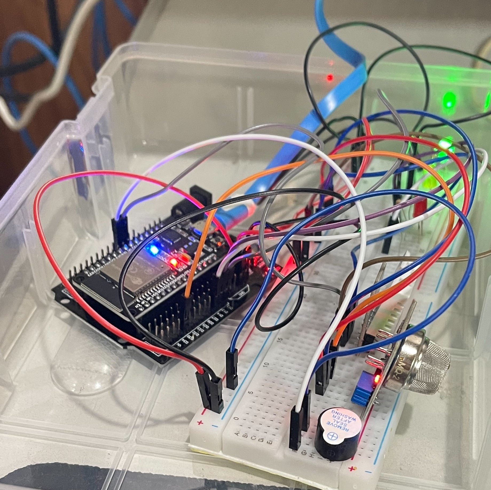

  <a href="#" onclick="switchLanguage('th')">TH</a> | <a href="#" onclick="switchLanguage('en')">EN</a>

  <a href="#" onclick="switchTheme()">Switch Theme</a>

  ESP32 for measuring gas and heat index.

  

  ## Table of Contents

  - [Download AllCode Folder](#download-allcode-folder)
  - [Add Library to Arduino](#add-library-to-arduino)
  - [Upload Arduino Code](#upload-arduino-code)
  - [Edit Python Code](#edit-python-code)
  - [Change Python Port (Optional)](#change-python-port-optional)
  - [Run Python Program](#run-python-program)
  - [Completion](#completion)
  - [Change Language (Optional)](#change-language-optional)

  | **Component** | **Pin on Module** | **Pin on Arduino** |
  |---------------|------------------|--------------------|
  | **Buzzer**    | VCC              | 3.3-5V             |
  |               | GND              | GND                |
  |               | I/O              | D13                |
  | **DHT22**     | VCC              | 3.3V               |
  |               | GND              | GND                |
  |               | Data             | D4                 |
  | **MQ-2**      | VCC              | 5V                 |
  |               | GND              | GND                |
  |               | Analog Out       | A35 (Pin 35)       |
  | **LEDs**      | Green            | D13 (Pin 13)       |
  |               | Yellow           | D12 (Pin 12)       |
  |               | Red              | D14 (Pin 14)       |
  | **Buzzer**    | Control Pin      | D16 (Pin 16)       |

  I use resistor 220 Ohm for each LED.

  ### Download AllCode Folder
  - Download AllCode and place it on your computer. You must not modify the folder structure in order to run the web server on Python correctly (so that you can easily test it before adapting it for other uses).

  ### Add Library to Arduino
  - Download the file libraries.7z from the provided GitHub link and add it to your library for easy setup. Arduino libraries are located at Documents\Arduino.

  ### Upload Arduino Code
  - Upload the provided Arduino code from AllCode to your ESP32.
  - Edit the code to your Wi-Fi SSID, password, and local IP address.

    

  ### Edit Python Code
  - Edit `webpython.py` to change the token for notifications, or leave it as is if not needed.

    

  ### Change Python Port (Optional)
  - You may change the port in the Python script if needed.

    

  ### Run Python Program
  - Run the Python script, and you should see output similar to the image below (use this URL to see your web server).

    

  ### Completion
  - Congratulations, you have successfully set everything up!

    

  ### Change Language (Optional)
  - You may need to change the `index` in the templates folder if you want the interface in English.

  [GitHub Repository](https://github.com/sunsonta/Esp32-DHT-22-and-MQ-2/tree/main)

  ESP32 สำหรับการวัดก๊าซและดัชนีความร้อน

  

  ## สารบัญ

  - [ดาวน์โหลดโฟลเดอร์ AllCode](#download-allcode-folder)
  - [เพิ่มไลบรารีไปยัง Arduino](#add-library-to-arduino)
  - [อัปโหลดโค้ด Arduino](#upload-arduino-code)
  - [แก้ไขโค้ด Python](#edit-python-code)
  - [เปลี่ยนพอร์ต Python (ไม่บังคับ)](#change-python-port-optional)
  - [รันโปรแกรม Python](#run-python-program)
  - [เสร็จสิ้น](#completion)
  - [เปลี่ยนภาษา (ไม่บังคับ)](#change-language-optional)

  | **ส่วนประกอบ** | **ขาพินบนโมดูล** | **ขาพินบน Arduino** |
  |---------------|------------------|--------------------|
  | **Buzzer**    | VCC              | 3.3-5V             |
  |               | GND              | GND                |
  |               | I/O              | D13                |
  | **DHT22**     | VCC              | 3.3V               |
  |               | GND              | GND                |
  |               | Data             | D4                 |
  | **MQ-2**      | VCC              | 5V                 |
  |               | GND              | GND                |
  |               | Analog Out       | A35 (Pin 35)       |
  | **LEDs**      | Green           | D13 (Pin 13)       |
  |               | Yellow          | D12 (Pin 12)       |
  |               | Red             | D14 (Pin 14)       |
  | **Buzzer**    | Control Pin       | D16 (Pin 16)       |

  ส่วนตัวใช้ตัวต้านทาน 220 โอห์มสำหรับ LED เเต่ละตัวครับ

  ### ดาวน์โหลดโฟลเดอร์ AllCode
  - ดาวน์โหลดAllCodeและวางไว้ในคอมพิวเตอร์ของคุณ คุณจะต้องไม่ยุ่งกับการย้ายไฟล์โครงสร้างโฟลเดอร์เพื่อรันเว็บเซิร์ฟเวอร์บน Python ได้ถูกต้อง(เพื่อให้testก่อนได้ง่ายเพื่อไปปรับใช้อย่างอื่นได้)

  ### เพิ่มไลบรารีไปยัง Arduino
  - โหลดไฟล์ `libraries.7z`ใน githudที่ให้มาเเล้วเพิ่มในไลบรารีของคุณเพื่อการตั้งค่าง่าย libraries Arduino อยู่ที่ `Documents\Arduino`

  ### อัปโหลดโค้ด Arduino
  - อัปโหลดโค้ด Arduino ที่ได้มาจาก AllCode ไปยัง ESP32 ของคุณ
  - แก้ไขโค้ดเพื่อให้ใช้กับ Wi-Fi SSID รหัสผ่าน และที่อยู่ IP ในเครื่องของคุณ

    

  ### แก้ไขโค้ด Python
  - แก้ไข `webpython.py` เพื่อเปลี่ยนโทเค็นสำหรับการแจ้งเตือน หรือปล่อยว่างไว้หากไม่ต้องการ

    

  ### เปลี่ยนพอร์ต Python (ไม่บังคับ)
  - คุณสามารถเปลี่ยนพอร์ตในสคริปต์ Python ได้หากจำเป็น

    

  ### รันโปรแกรม Python
  - รันสคริปต์ Python แล้วคุณจะเห็นผลลัพธ์ที่คล้ายกับภาพด้านล่าง (ใช้ URL นี้เพื่อดูเว็บเซิร์ฟเวอร์ของคุณ)

    

  ### เสร็จสิ้น
  - ยินดีด้วย คุณได้ตั้งค่าทุกอย่างเรียบร้อยแล้ว!

    

  ### เปลี่ยนภาษา (ไม่บังคับ)
  - คุณอาจต้องเปลี่ยน `index` ในโฟลเดอร์เทมเพลตหากต้องการให้หน้าเเสดงผลเป็นภาษาอังกฤษ

  [GitHub Repository](https://github.com/sunsonta/Esp32-DHT-22-and-MQ-2/tree/main)

