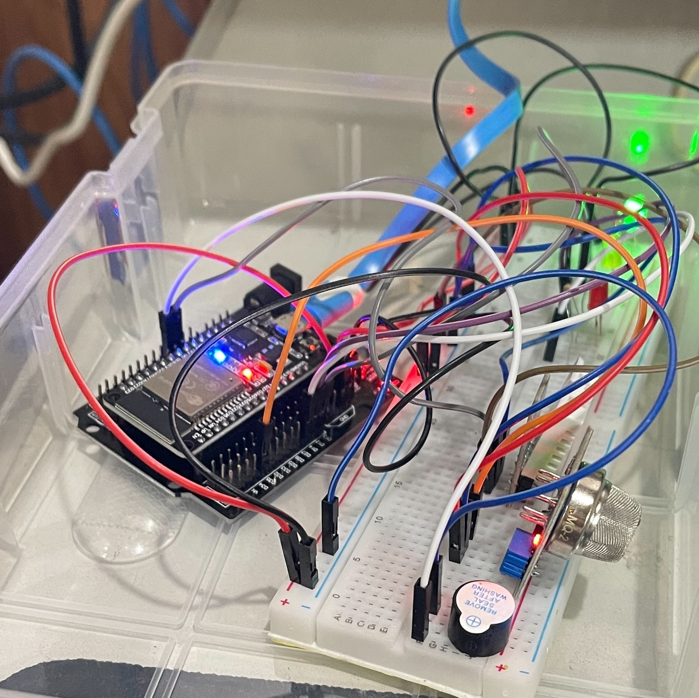

## เปลี่ยนภาษา

 
  
# ESP32 ตรวจจับก๊าซและอุณหภูมิ

  

  ## สารบัญ

  - [ดาวน์โหลดโฟลเดอร์ AllCode](#download-allcode-folder)
  - [เพิ่มไลบรารีไปยัง Arduino](#add-library-to-arduino)
  - [อัปโหลดโค้ด Arduino](#upload-arduino-code)
  - [แก้ไขโค้ด Python](#edit-python-code)
  - [เปลี่ยนพอร์ต Python (ไม่บังคับ)](#change-python-port-optional)
  - [รันโปรแกรม Python](#run-python-program)
  - [เสร็จสิ้น](#completion)
  - [เปลี่ยนภาษา (ไม่บังคับ)](#change-language-optional)

  | **ส่วนประกอบ** | **ขาพินบนโมดูล** | **ขาพินบน Arduino** |
  |---------------|------------------|--------------------|
  | **Buzzer**    | VCC              | 3.3-5V             |
  |               | GND              | GND                |
  |               | I/O              | D13                |
  | **DHT22**     | VCC              | 3.3V               |
  |               | GND              | GND                |
  |               | Data             | D4                 |
  | **MQ-2**      | VCC              | 5V                 |
  |               | GND              | GND                |
  |               | Analog Out       | A35 (Pin 35)       |
  | **LEDs**      | Green           | D13 (Pin 13)       |
  |               | Yellow          | D12 (Pin 12)       |
  |               | Red             | D14 (Pin 14)       |
  | **Buzzer**    | Control Pin       | D16 (Pin 16)       |

  ส่วนตัวใช้ตัวต้านทาน 220 โอห์มสำหรับ LED เเต่ละตัวครับ

  ### ดาวน์โหลดโฟลเดอร์ AllCode
  - ดาวน์โหลดAllCodeและวางไว้ในคอมพิวเตอร์ของคุณ คุณจะต้องไม่ยุ่งกับการย้ายไฟล์โครงสร้างโฟลเดอร์เพื่อรันเว็บเซิร์ฟเวอร์บน Python ได้ถูกต้อง(เพื่อให้testก่อนได้ง่ายเพื่อไปปรับใช้อย่างอื่นได้)

  ### เพิ่มไลบรารีไปยัง Arduino
  - โหลดไฟล์ libraries.7zใน githudที่ให้มาเเล้วเพิ่มในไลบรารีของคุณเพื่อการตั้งค่าง่าย libraries Arduino อยู่ที่ Documents\Arduino

  ### อัปโหลดโค้ด Arduino
  - อัปโหลดโค้ด Arduino ที่ได้มาจาก AllCode ไปยัง ESP32 ของคุณ
  - แก้ไขโค้ดเพื่อให้ใช้กับ Wi-Fi SSID รหัสผ่าน และที่อยู่ IP ในเครื่องของคุณ

    

  ### แก้ไขโค้ด Python
  - แก้ไข webpython.py เพื่อเปลี่ยนLineTokenสำหรับการแจ้งเตือนในLine Notify หรือปล่อยว่างไว้หากไม่ต้องการ

    

  ### เปลี่ยนพอร์ต Python (ไม่บังคับ)
  - คุณสามารถเปลี่ยนพอร์ตในสคริปต์ Python ได้หากจำเป็น

    

  ### รันโปรแกรม Python
  - รันสคริปต์ Python แล้วคุณจะเห็นผลลัพธ์ที่คล้ายกับภาพด้านล่าง (ใช้ URL นี้เพื่อดูเว็บเซิร์ฟเวอร์ของคุณ)

    

  ### เสร็จสิ้น
  - ยินดีด้วย คุณได้ตั้งค่าทุกอย่างเรียบร้อยแล้ว!

    

  ### เปลี่ยนภาษา (ไม่บังคับ)
  - คุณอาจต้องเปลี่ยน index ในโฟลเดอร์เทมเพลตหากต้องการให้ส่วนติดต่อเป็นภาษาอังกฤษ

  [GitHub Repository](https://github.com/sunsonta/Esp32-DHT-22-and-MQ-2/tree/main)

